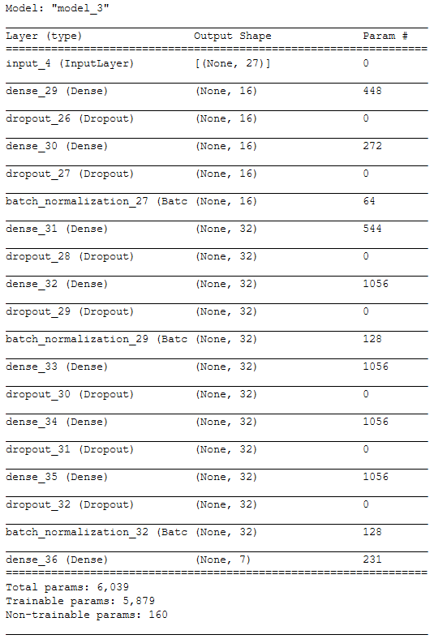
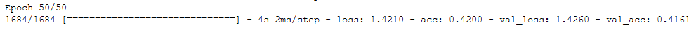

# spiky-task

## Oversampling Data

The data was unbalanced; to balance out the data, SMOTE function from **imbalanced-learn** module was used.

## Training the Model

    Training with the untouched data didn't generated good results. 
    
    